# Minor Projects 🎨

A collection of frontend experiments built while learning UI design, animations, and JavaScript.

**HTML · CSS · JavaScript · Tailwind CSS**

---

## 📂 Projects

| Project | What it is |
|---------|------------|
| Dribble Project | Premium UI clone |
| TASK — Reel | Reel-style UI interaction |
| TASK — Spotlight | Spotlight cursor effect |
| TASK — Cursor | Custom sword cursor replacing default arrow |
| TASK — Font Change | Dynamic font switcher |
| Piano | Interactive JS Piano |
| Border Card | CSS animated card |
| Anchor PJ | Scroll animation |
| Simple Web 1 & 2 | Layout practice |
| CSS Projects (1-3) | CSS experiments |

---

## 🖼️ Screenshots

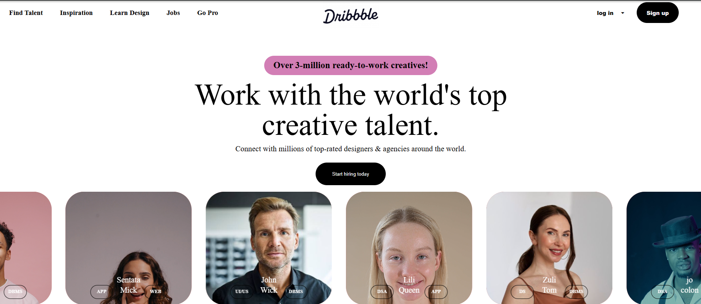
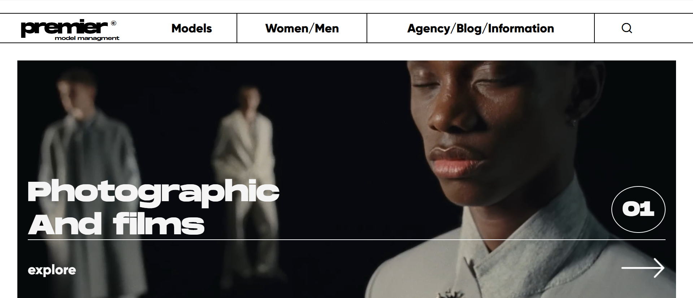
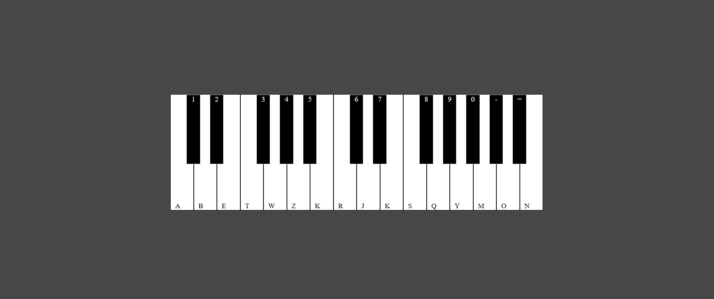
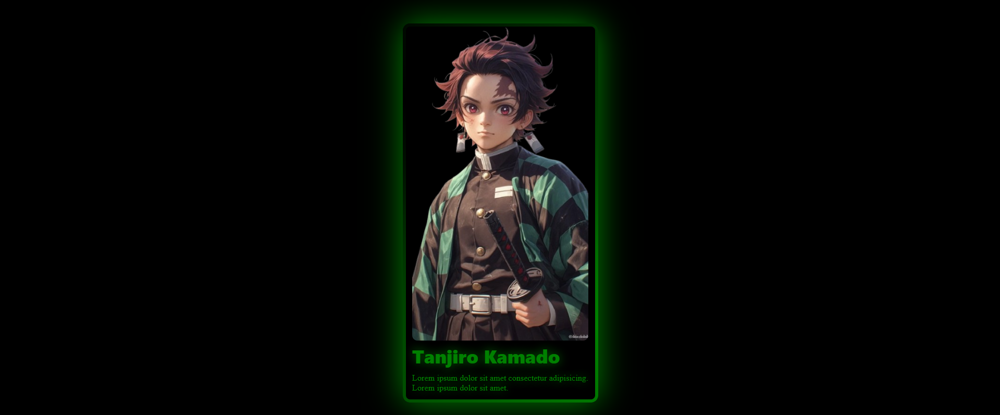
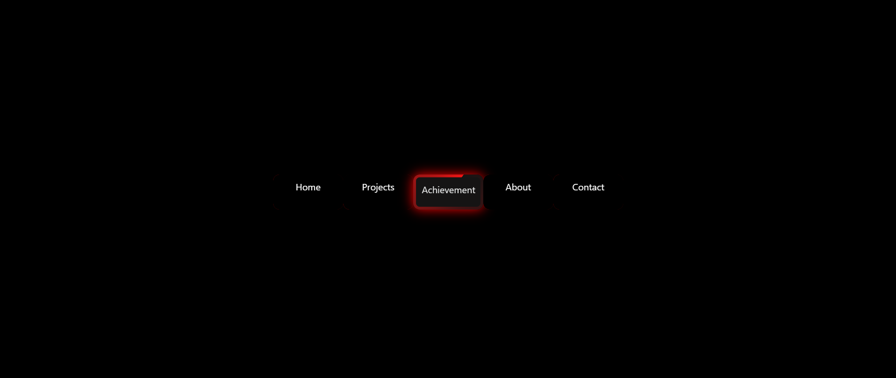
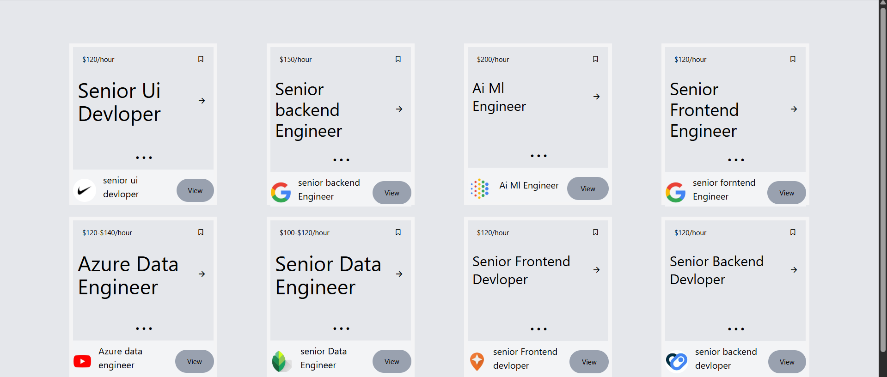
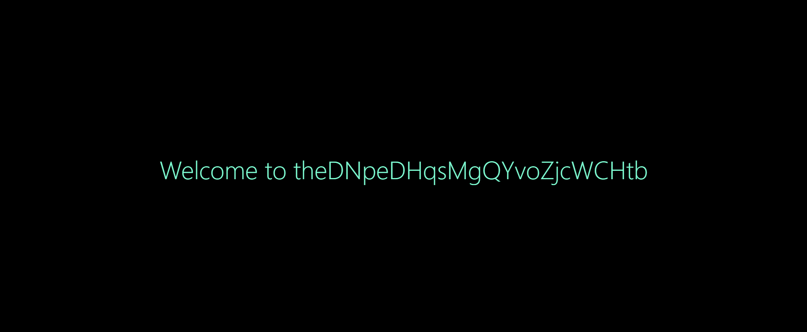
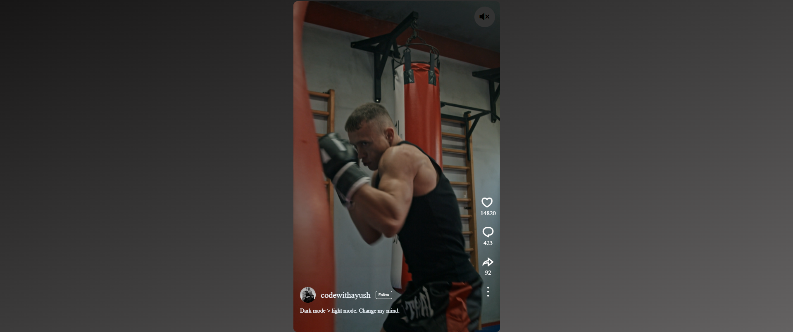
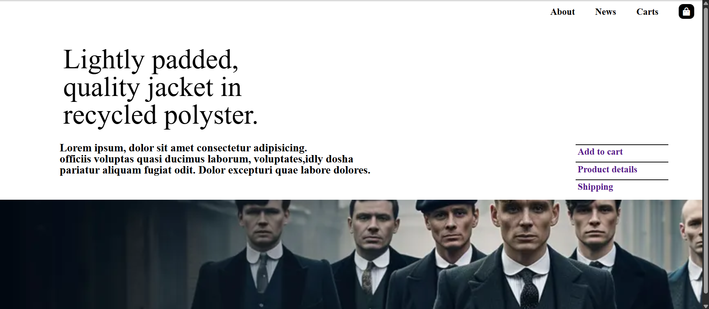
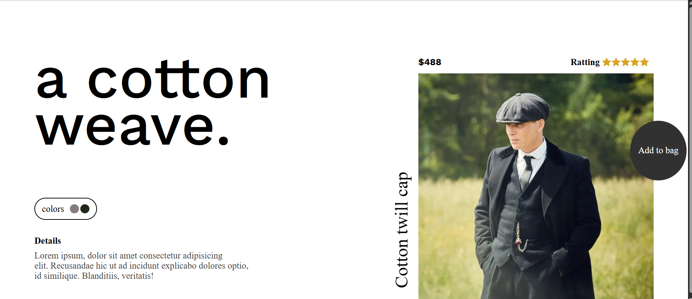

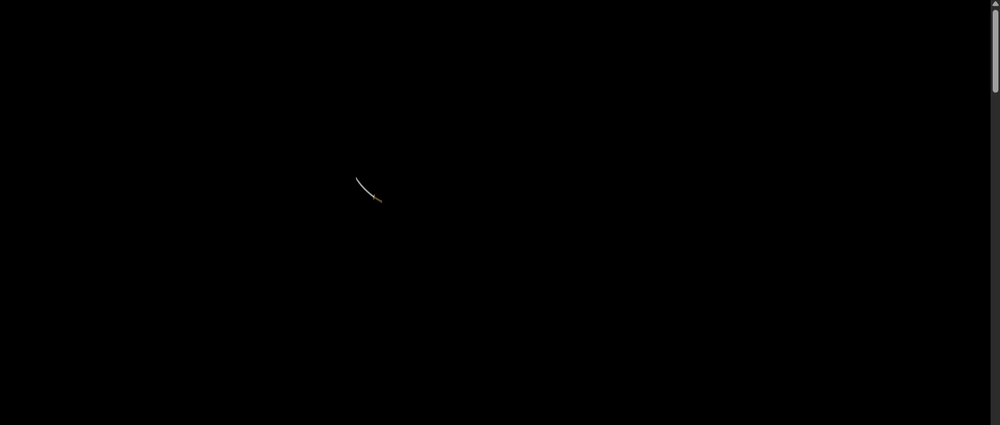
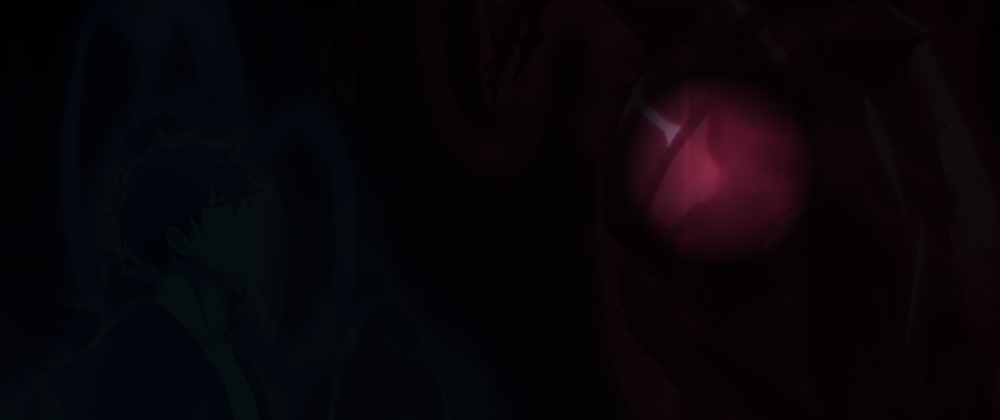
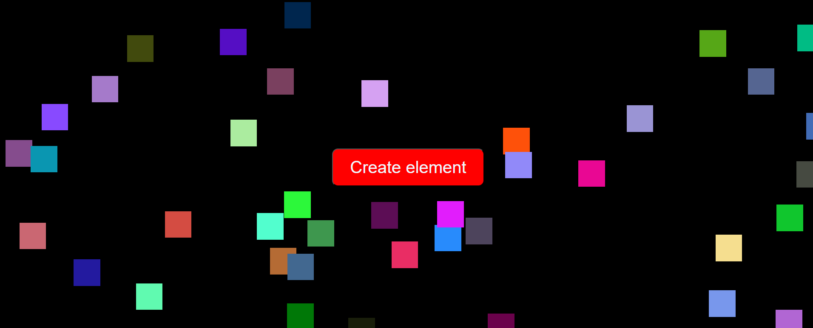
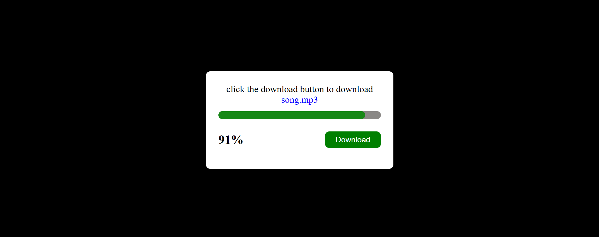
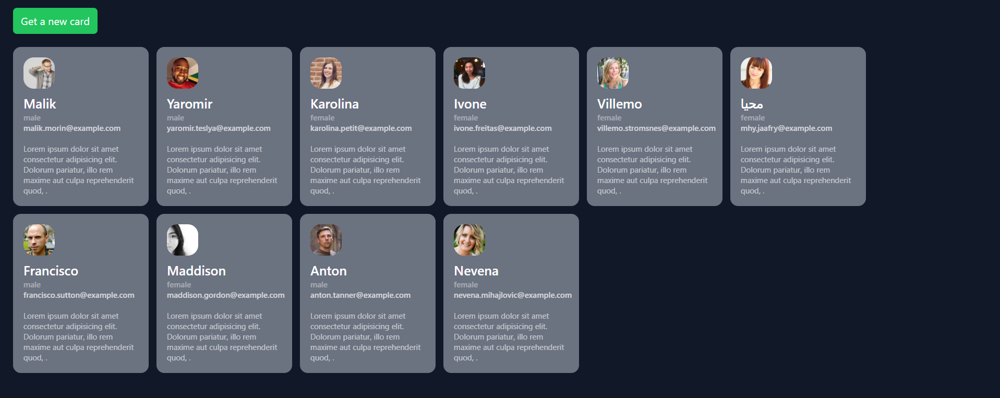
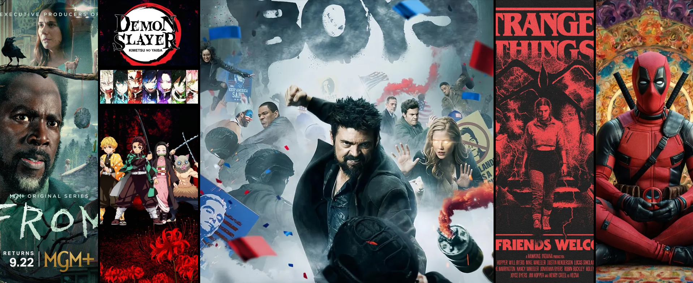
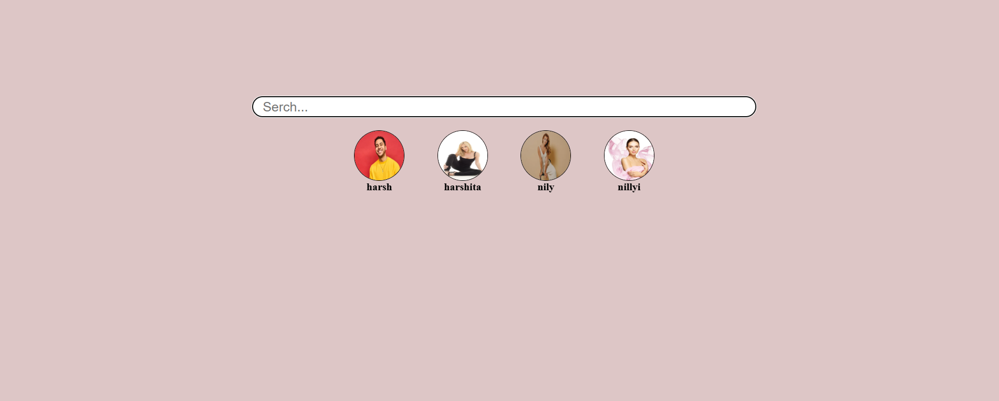
---

💻 Building. Learning. Scaling.

